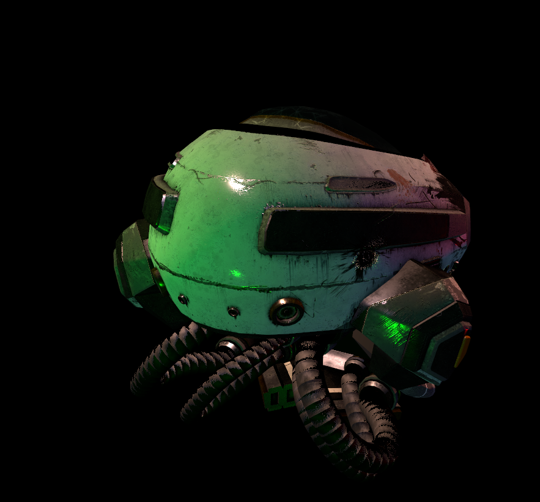
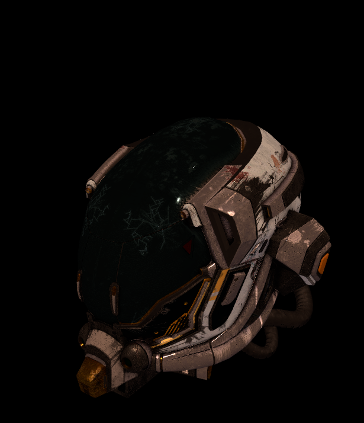

# Tiny Engine 🎮
**A lightweight, cross-platform 3D game engine in C++**


## About
Tiny Engine is **designed for medium-scale and high-scale projects**. It’s written in modern C++ and keeps dependencies minimal so you can easily explore engine internals and customize subsystems. Supported platforms include **Windows**, **Linux**, and **macOS**.

---

## Features

### Graphics
- **Vulkan** graphics subsystem for low-level control and performance  
- **Physically Based Rendering (PBR)** with metallic-roughness workflow  
- **Normal mapping** to simulate surface detail  
- **Multisample anti-aliasing (MSAA)** for smoother edges  

### Scene and Culling
- **Scene graph** and object hierarchy  
- **Frustum culling** to skip rendering off-camera objects  
- **Multithreaded rendering** to leverage multi-core CPUs  

### Assets
- **glTF** model loader (including textures)  
- Texture formats: PNG, JPEG

### Input and Interaction
- **Keyboard and mouse** input processing  

## Screenshots

|  |  |
| --------------------------------------- | --------------------------------------- |

## Download & Build

1. **Clone the repository**  
   ```bash
   git clone https://github.com/zen4xx/tiny_engine.git
   cd tiny_engine
   ```

2. **Build**  
   ```bash
   cmake CMakeLists.txt
   make
   ```

## Wiki: https://github.com/tiny_engine/wiki